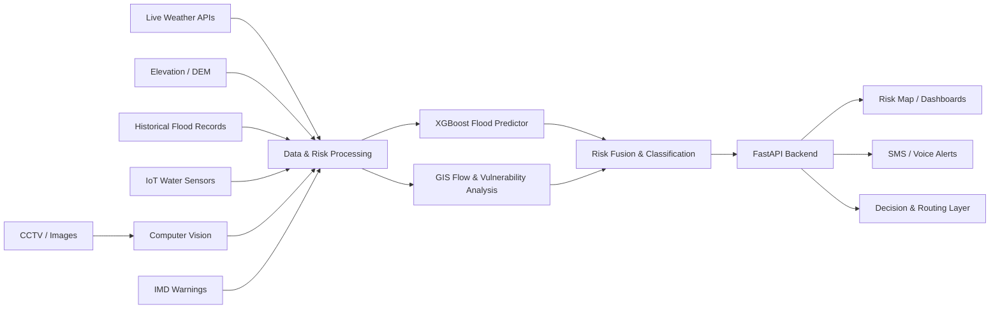

# 🌧️ Climate-Resilient City

> **Hyperlocal Flood & Urban Waterlogging Early-Warning System**  
> Predicting where and when urban flooding is likely to occur so authorities and citizens can act before a crisis escalates.

[](#ikigai-2026)
[](#technology-stack)
[](#ai-and-ml)
[](#)

## 👥 Team

**Team:** Wide Watcher  
**Institution:** Dhanalakshmi Srinivasan University

### Team Members

- Shamirudeen R
- Naveen Alfred Anto
- Santhosh
- Varsha Priya

---

## 🎯 Problem Statement

Extreme rainfall events can create dangerous urban waterlogging within a short period of time. Conventional weather forecasts generally provide broad, city-level information, but urban flooding is often controlled by much more localized factors such as elevation, drainage capacity, road topology, rainfall intensity, and existing water accumulation.

This creates a critical **hyperlocal prediction gap**: authorities may know that heavy rain is coming, while still not knowing which underpass, intersection, or low-lying street is likely to become dangerous first.

**Climate-Resilient City** addresses this gap by combining live weather information, historical flood records, terrain/GIS information, IoT water-level observations, computer-vision observations, and machine-learning risk estimation to produce localized flood-risk information and actionable alerts.

---

## 💡 Our Solution

The system is designed as a decision-support platform for both **city authorities** and **citizens**.

It aims to move urban flood response from:

**React → Detect → Respond**

toward:

**Predict → Warn → Reroute → Respond**

### Primary Users

- Emergency management departments
- Municipal public works agencies
- Traffic police
- Smart-city command centers

### Secondary Users

- Local residents
- Daily commuters
- Drivers and transit systems

---

## ✨ Key Capabilities

### 1. 🗺️ Real-Time Predictive Risk Dashboard

A GIS-oriented dashboard visualizes localized risk zones using graduated severity levels such as:

- 🟢 Green — Low/Safe
- 🟡 Yellow — Caution
- 🟠 Orange — High Risk
- 🔴 Red — Critical

The backend exposes a fused `/api/zones` endpoint that combines available risk signals for configured zones.

### 2. 🤖 Flood / Waterlogging Prediction

The flood predictor uses XGBoost when a trained model is available and provides a transparent rule-based fallback when a trained model artifact is unavailable.

Relevant model inputs include:

- Forecast rainfall
- Elevation
- Drainage capacity
- Historical flood frequency

### 3. 📷 Computer-Vision Flood Detection

CCTV/image frames can be submitted for water detection. The repository includes:

- Classical OpenCV-based water/wet-surface detection
- Optional U-Net segmentation support

The detected water coverage is converted into severity levels.

### 4. 📡 IoT Water-Level Ingestion

The backend provides an ingestion endpoint for water-level sensor telemetry.

Example:

```text
POST /api/iot/ingest?zone_id=zone_2&water_level_cm=45&sensor_id=drain_01
```

The endpoint is designed to accept telemetry from devices such as ESP32/ESP8266-class systems.

### 5. 🚨 Automated Alerts

The system includes Twilio-based SMS/voice alert functionality and a background notification loop.

The notification logic is edge-triggered: a notification is generated when a zone's alert level newly rises rather than repeatedly sending the same alert.

### 6. 🛰️ GIS Risk Analysis

The GIS add-on provides a multi-step pipeline for:

1. Rainfall categorization
2. DEM-based flow direction and accumulation
3. Drainage/vulnerability analysis
4. Composite risk calculation
5. Risk heatmap generation

### 7. 🌡️ Multi-Hazard Extension

In addition to flood/waterlogging risk, the repository includes risk modules for:

- Heat
- Water shortage

This allows the platform to evolve toward a broader climate-resilience decision-support system.

---

## 🏗️ System Architecture



---

## 🔄 End-to-End Workflow

```text
Live weather + historical records + GIS + IoT + CCTV
                         ↓
              Data preprocessing
                         ↓
          Feature extraction / GIS analysis
                         ↓
             Flood-risk prediction
                         ↓
             Risk classification
          GREEN → YELLOW → ORANGE → RED
                         ↓
              Decision / alert layer
                         ↓
       ┌─────────────────┼─────────────────┐
       ↓                 ↓                 ↓
   Authorities       Citizens          Drivers
   Dashboard        SMS / Alerts      Safe routing
```

---

## 🤖 AI and ML

### Flood Predictor

**Algorithm:** XGBoost classifier

The model is intended to learn the non-linear relationship between factors such as:

```text
Rainfall + Elevation + Drainage + Historical Flood Frequency
                         ↓
                  Flood Probability
```

The repository also contains a rule-based fallback so that the API can continue to produce transparent risk estimates when a trained XGBoost model artifact is not available.

### Computer Vision

The repository supports two modes:

| Mode | Approach |
|---|---|
| Baseline | HSV analysis + specular reflection detection + morphology |
| Deep learning | U-Net segmentation when a trained model is supplied |

### Deterministic Safety Layer

The system separates probabilistic model output from auditable alert policy:

```text
XGBoost probability
       ↓
Risk threshold classification
       ↓
IMD severity / safety policy
       ↓
Final alert level
```

This design is intended to make emergency-facing decisions more explainable and conservative.

---

## 📊 Data Sources

The proposed system uses multiple classes of environmental and infrastructure data.

### Historical Meteorological Data

**Source:** India Meteorological Department / national meteorological sources  
**Purpose:** Historical rainfall patterns and extreme precipitation analysis.

### Elevation / DEM

**Source:** Copernicus / Indian geospatial sources such as Bhuvan/Cartosat  
**Purpose:** Identify low-lying areas, drainage direction, and terrain-driven runoff patterns.

### OpenStreetMap

**Source:** OpenStreetMap  
**Purpose:** Road, waterway, and urban network information for geographic analysis and routing.

### Land-Cover Data

**Source:** ESA WorldCover  
**Purpose:** Surface classification and estimation of runoff/permeability characteristics.

### Historical Flood Records

The repository contains:

```text
backend/data/historical_flood_events.csv
```

These records are used by the flood prediction pipeline.

### Live Data

The current backend integrates or supports:

- Open-Meteo weather data
- Open-Elevation elevation data
- IMD warning/AWS data
- IoT water-level telemetry
- CCTV/image observations

---

## 🧰 Technology Stack

| Layer | Technology |
|---|---|
| Frontend | React + Tailwind CSS *(declared project stack)* |
| Backend | FastAPI |
| Machine Learning | XGBoost |
| Computer Vision | OpenCV / optional U-Net |
| GIS | DEM flow accumulation and geospatial processing |
| Database | PostgreSQL *(declared project stack)* |
| Maps | Leaflet |
| Notifications | Twilio |
| IoT | REST / ESP32-class sensors |
| Weather | Open-Meteo |
| Elevation | Open-Elevation |
| Government Weather Data | IMD APIs |
| Deployment | Vercel + Render |

> **Implementation note:** The public repository currently exposes `frontend/index.html`, `citizen.html`, and `official.html` alongside the FastAPI backend. PostgreSQL/React/Tailwind/Leaflet are part of the declared target stack; deployment and integration status should be verified against the current deployment configuration before the final demonstration.

---

## 📁 Repository Structure

```text
climate-resilient-city/
│
├── backend/
│   ├── main.py
│   ├── data_sources.py
│   ├── subscribers.py
│   ├── requirements.txt
│   │
│   ├── models/
│   │   ├── flood_predictor.py
│   │   ├── train_flood_model.py
│   │   ├── cv_flood_detector.py
│   │   ├── train_segmentation_model.py
│   │   └── heat_water_models.py
│   │
│   ├── alerts/
│   │   └── call_alert.py
│   │
│   ├── gis_addon/
│   │   ├── run_all.py
│   │   ├── README.md
│   │   └── src/
│   │       ├── rainfall_categorizer.py
│   │       ├── flow_accumulation.py
│   │       ├── gis_vulnerability.py
│   │       ├── fuse_risk_model.py
│   │       └── visualize.py
│   │
│   └── data/
│       ├── zones.json
│       └── historical_flood_events.csv
│
├── frontend/
│   ├── index.html
│   ├── citizen.html
│   └── official.html
│
└── README.md
```

---

## 🔌 API Endpoints

| Method | Endpoint | Purpose |
|---|---|---|
| `GET` | `/api/zones` | Retrieve fused risk for configured zones |
| `POST` | `/api/iot/ingest` | Ingest IoT water-level data |
| `POST` | `/api/cv/analyze` | Analyze CCTV/image frame |
| `POST` | `/api/alerts/trigger` | Trigger voice alerts |
| `POST` | `/api/alerts/message` | Send SMS alerts |
| `POST` | `/api/subscribe` | Subscribe to zone alerts |
| `POST` | `/api/unsubscribe` | Unsubscribe from alerts |
| `POST` | `/api/gis-addon/run` | Run GIS risk pipeline |
| `GET` | `/api/gis-addon/status` | View GIS risk statistics |
| `GET` | `/api/gis-addon/heatmap` | Retrieve generated risk heatmap |

---

## 🚀 Getting Started

### 1. Clone the repository

```bash
git clone https://github.com/shameer100s7-collab/climate-resilient-city.git
cd climate-resilient-city
```

### 2. Install backend dependencies

```bash
pip install -r backend/requirements.txt
```

### 3. Configure environment variables

Configure Twilio credentials if SMS/voice notifications are required:

```bash
TWILIO_ACCOUNT_SID="your_account_sid"
TWILIO_AUTH_TOKEN="your_auth_token"
TWILIO_FROM_NUMBER="+1234567890"
AUTO_NOTIFY_INTERVAL_SECONDS=300
```

Never commit API keys, authentication tokens, or other secrets to GitHub.

### 4. Start the backend

```bash
cd backend
uvicorn main:app --reload --host 0.0.0.0 --port 8000
```

### 5. Open the application

```text
Citizen Dashboard:
http://localhost:8000/citizen.html

Official Dashboard:
http://localhost:8000/official.html

API Documentation:
http://localhost:8000/docs
```

---

## 🧪 Model Training & Evaluation

### Train the flood model

```bash
cd backend/models
python train_flood_model.py
```

The training pipeline produces a model artifact that can be consumed by the flood predictor.

Evaluation output includes classification metrics, confusion matrix information, and cross-validation results when the training pipeline is executed.

### Train the U-Net segmentation model

```bash
pip install segmentation-models-pytorch torch torchvision
python backend/models/train_segmentation_model.py
```

A trained segmentation model can then be used by the CV detector.

---

## ⚠️ Current Implementation Status

The platform is being developed as a hackathon prototype. Capabilities should be distinguished between implemented components, optional trained-model paths, and future production integrations.

| Capability | Status |
|---|---|
| FastAPI backend | ✅ Implemented |
| Live weather/elevation retrieval | ✅ Implemented |
| XGBoost flood-prediction path | ✅ Implemented |
| Rule-based flood fallback | ✅ Implemented |
| Historical flood CSV integration | ✅ Implemented |
| CCTV/OpenCV flood detection | ✅ Implemented |
| U-Net segmentation | 🟡 Requires trained model |
| IoT REST ingestion | ✅ Implemented |
| Twilio alerts | ✅ Implemented |
| GIS flow/risk pipeline | 🟡 Prototype/add-on; data source configuration required |
| Production-grade street-level water-depth forecasting | 🟡 Requires further calibration and validation |
| Full production city-scale deployment | 🟡 Future scope |

---

## 🌍 Impact

### 1. Protecting Life

Early warnings can help residents and authorities avoid dangerous roads, underpasses, vehicles, and low-lying areas.

### 2. Faster Emergency Response

Authorities can prioritize rescue teams, pumps, drain-clearing operations, and road closures around predicted high-risk zones.

### 3. Smarter Mobility

Flood-aware routing can help commuters and emergency responders avoid dangerous road segments.

### 4. Better Use of Limited Resources

Instead of deploying emergency resources uniformly, cities can prioritize locations with the highest predicted risk.

---

## 📈 Scalability

The architecture is designed around configurable geographic zones, allowing the same concept to be extended from:

```text
Single Street
    ↓
Neighborhood
    ↓
City
    ↓
Multiple Cities
    ↓
Regional Climate-Risk Platform
```

The same framework can ingest different municipal sensor networks, weather feeds, GIS layers, and historical event datasets for new cities.

---

## 🔮 Future Scope

- High-resolution Tamil Nadu city-level flood datasets
- More extensive historical flood-event labeling
- Real municipal drainage-network data
- More IoT water-level sensors
- Calibrated street-level water-depth prediction
- Improved flood segmentation models
- Integration with official emergency-response systems
- Multilingual citizen alerts
- Mobile application
- Advanced route optimization
- Digital-twin simulation for infrastructure planning
- Continuous model retraining from validated flood observations

---

## 🏆 IKIGAI 2026 Alignment

**Track:** ClimateTech, Energy and Disaster Resilience

The project focuses on climate adaptation and disaster resilience by combining environmental data, machine learning, GIS analysis, IoT telemetry, computer vision, and automated communication to support earlier and more localized urban-flood decisions.

### Core Value Proposition

> **From city-wide rainfall forecasts to actionable, hyperlocal flood-risk intelligence.**

---

## 👨‍💻 Team — Wide Watcher

Built by students of **Dhanalakshmi Srinivasan University** for the **IKIGAI 2026 ClimateTech, Energy and Disaster Resilience** track.

**Team Members**

- Shamirudeen R
- Naveen Alfred Anto
- Santhosh
- Varsha Priya

---

## 🔗 Repository

**GitHub:**  
https://github.com/shameer100s7-collab/climate-resilient-city

---

## 📚 References

- India Meteorological Department (IMD)
- Open-Meteo
- Open-Elevation
- OpenStreetMap
- ESA WorldCover
- Copernicus DEM
- Bhuvan / Cartosat
- XGBoost
- OpenCV
- segmentation-models-pytorch
- FloodNet
- Twilio

---

## 📄 Project Note

This repository represents a hackathon-oriented prototype and research implementation. Predictions should be treated as decision-support outputs rather than guaranteed flood forecasts. Production deployment would require city-specific calibration, validated historical event labels, sensor-quality controls, operational testing, and coordination with authorized emergency-management agencies.
